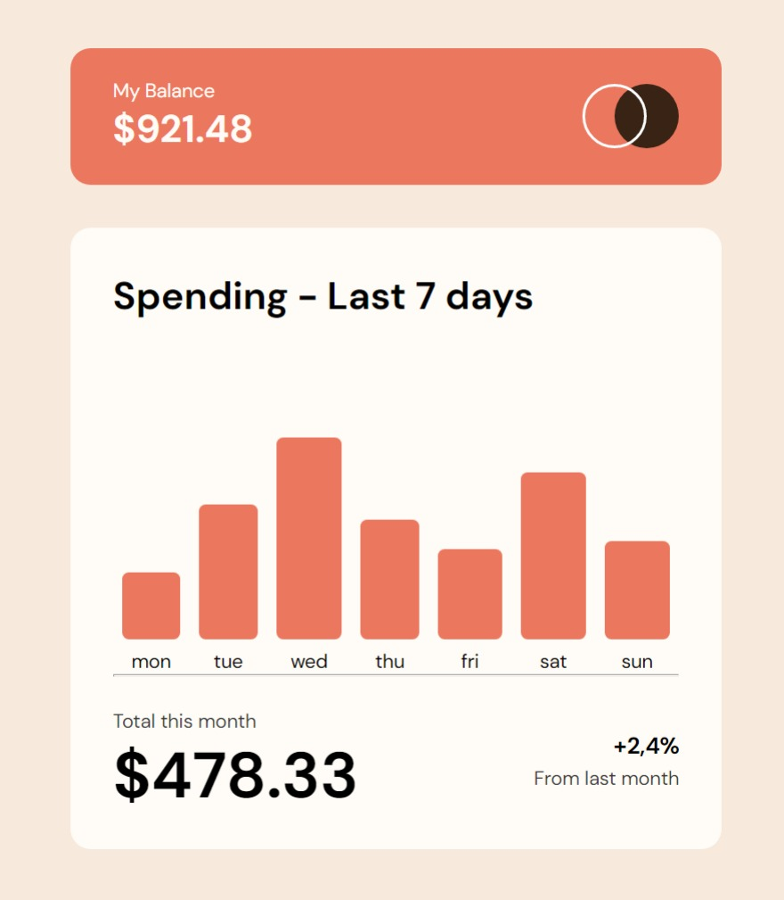

# Frontend Mentor - Expenses chart component solution

This is a solution to the [Expenses chart component challenge on Frontend Mentor](https://www.frontendmentor.io/challenges/expenses-chart-component-e7yJBUdjwt). Frontend Mentor challenges help you improve your coding skills by building realistic projects. 

## Table of contents

- [Overview](#overview)
  - [The challenge](#the-challenge)
  - [Screenshot](#screenshot)
  - [Links](#links)
- [My process](#my-process)
  - [Built with](#built-with)
  - [What I learned](#what-i-learned)
  - [Continued development](#continued-development)
  - [Useful resources](#useful-resources)
- [Author](#author)


**Note: Delete this note and update the table of contents based on what sections you keep.**

## Overview

### The challenge

Users should be able to:

- View the bar chart and hover over the individual bars to see the correct amounts for each day
- View the optimal layout for the content depending on their device’s screen size
- See hover states for all interactive elements on the page
- **Bonus**: Used the JSON data file provided to dynamically size the bars on the chart

### Screenshot



### Links

- Solution URL: [Add solution URL here](https://your-solution-url.com)
- Live Site URL: [Add live site URL here](https://your-live-site-url.com)

## My process

### Built with

- Semantic HTML5 markup
- CSS custom properties
- Flexbox
- CSS Grid
- Mobile-first workflow


### What I learned

Most of the heavy lifting was done by the script, creating DOM elements and mapping them to a parent container which is a first since I'm used to hardcoded data.


I first had a problem with importing the json file from a different folder, and with struggling over 30+ minutes, I learned about the __assertion proposal__ and how it improved security when importing JSON modules and similar module types which cannot execute code.

```js
import myJson from './example.json' assert {type: 'json'};
```


### Continued development

I would like to improve on how I write my javscript logic and it's structure, did notice how messy and hard to understand it can be at times. And how to comment cause it could write a noval, it's that bad.

### Useful resources

- [How to import a JSON file in JavaScript](https://bobbyhadz.com/blog/javascript-import-json-file) - Where I learned about assertion.

## Author

- Frontend Mentor - [@yourusername](https://www.frontendmentor.io/profile/yourusername)
- Twitter - [@karabo_dev](https://twitter.com/karabo_dev)


